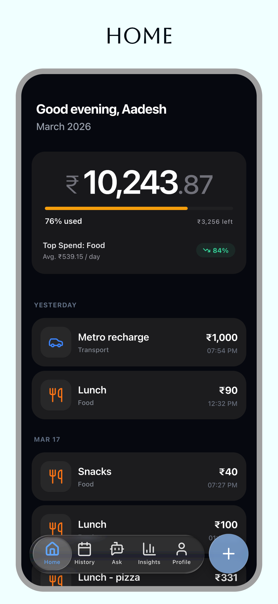
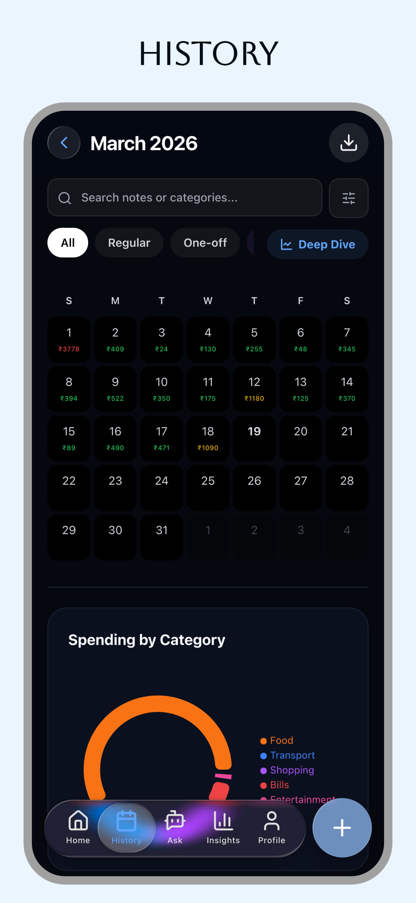
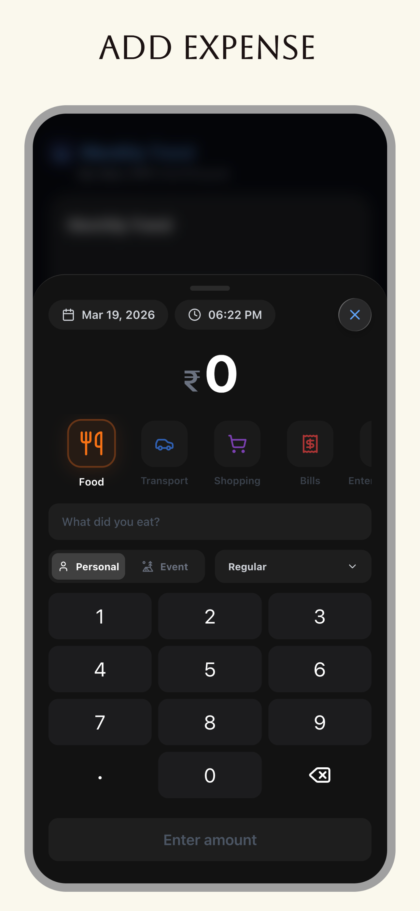
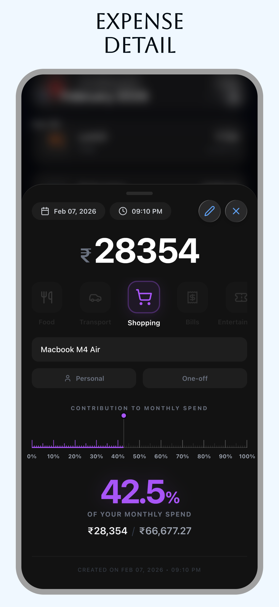
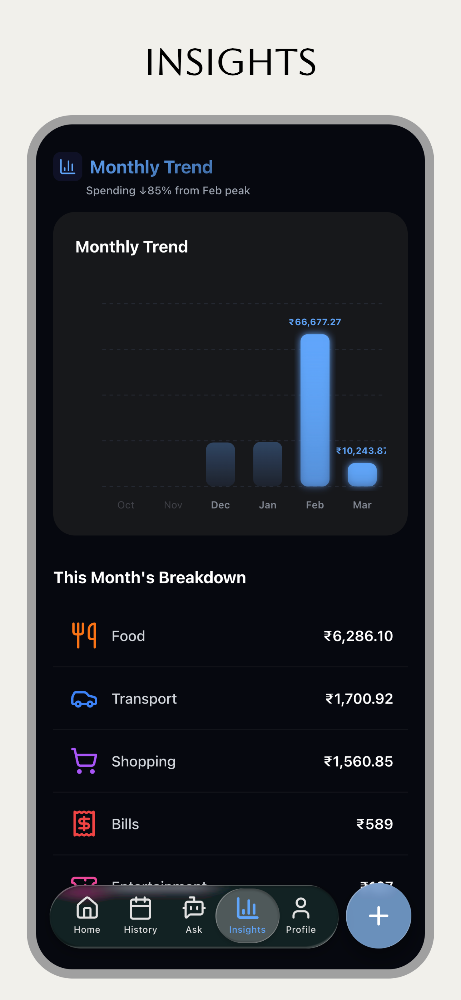
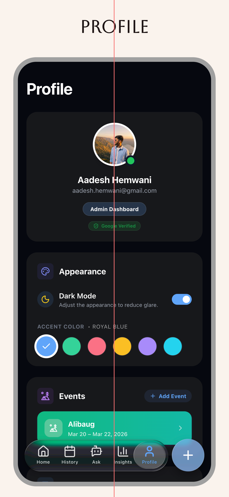

# ExpenseTracker

> A meticulously crafted, insight-driven expense tracking application designed to bring clarity and elegance to personal finance.

[](https://expenses-a2401.web.app/)

---

## ✨ Highlights

- **Visual Brilliance:** Breaks away from conventional spreadsheet-like layouts, favoring a clean, dark-themed UI with strong visual hierarchy.
- **Micro-interactions:** Powered by Framer Motion, the app feels alive with subtle glowing effects, fluid animations, and satisfying feedback (like confetti on achieving goals).
- **Data as Art:** Each transaction features unique generative visual elements, turning mundane expense logs into an engaging, visual ledger.
- **Deep Insights:** Emphasizes *where* your money goes, visualizing the contribution of each expense against your total spend.
- **Performance First:** Built on React 19 + TypeScript + Vite for an incredibly snappy, instant user experience.

---

## 📸 See It In Action

*Replace with actual image paths or URLs*

<div align="center">
  
  
  
</div>
<br/>
<div align="center">
  
  
  
</div>

---

## 🚀 Features

- **Intuitive Expense Tracking:** Effortlessly add and categorize expenses with an elegant, frictionless global modal.
- **Contribution Visualization:** See exactly how each purchase impacts your overall budget—percentage breakdowns are designed to be the dominant visual element.
- **Smart Budget Tracking:** Real-time trajectory charts ensure you always know if you're pacing correctly throughout the month.
- **AI-Powered Insights:** Get personalized financial guidance and spending trend analysis directly within the app.
- **Event-Specific Budgets:** Group expenses under specific events (like trips or weddings) with dedicated budget tracking for that occasion.
- **Export & Reporting:** Generate beautiful PDF reports of your spending habits instantly.

---

## 🎨 Design Approach

Most expense trackers overwhelm users with data dumps. **ExpenseTracker** was built on the philosophy that finance should be clear, actionable, and beautiful.

- **Beyond Spreadsheets:** Instead of rows of text, data is presented through curated cards, bold typography, and intuitive charts.
- **Focus & Hierarchy:** Important metrics (like contribution percentages) are designed to capture attention immediately, ensuring you digest the most critical information first.
- **Premium Fintech Aesthetic:** Uses a carefully tuned dark mode palette with bespoke `hsl` variables, soft shadows, and subtle gradients to feel like a high-end financial tool.

---

## 🛠️ Technical Overview

The architecture is designed for maintainability, speed, and real-time responsiveness.

- **Frontend:** React 19, TypeScript
- **Build Tool:** Vite (configured as a PWA)
- **Styling:** Tailwind CSS (with custom design system tokens) + Styled Components
- **Animations:** Framer Motion
- **Data Visualization:** Recharts
- **Backend & Database:** Firebase Auth & Firestore
- **Misc:** `date-fns` for time manipulation, `jsPDF` for reporting

### Architecture
The app follows a modern feature-based structure with clear separation of concerns (Views, Components, Services, Hooks, Contexts). Real-time synchronization is handled via Firestore listeners to keep the UI universally updated without manual refreshes.

---

## 📂 Folder Structure

```text
src/
├── components/   # Reusable UI elements, modals, and charts
├── context/      # React contexts (Theme, Auth, Global Modals)
├── hooks/        # Custom React hooks for business logic
├── pages/        # Top-level route components (Home, Analytics, etc.)
├── services/     # Firebase interaction and API wrappers
├── types/        # TypeScript interfaces and type definitions
└── utils/        # Helper functions and constants
```

---

## ⚙️ Setup Instructions

To run the project locally:

1. **Clone the repository:**
   ```bash
   git clone https://github.com/your-username/ExpenseTracker.git
   cd ExpenseTracker
   ```

2. **Install dependencies:**
   ```bash
   npm install
   ```

3. **Environment Setup:**
   - Create a `.env` file in the root directory.
   - Add your Firebase config credentials (e.g., `VITE_FIREBASE_API_KEY`, etc.).

4. **Start the development server:**
   ```bash
   npm run dev
   ```

---

## 🔮 Future Improvements

- **Plaid/Bank Integration:** Automatically import transactions from linked financial institutions.
- **Multi-currency Support:** Allow for logging expenses in various currencies with real-time conversion.
- **Shared Wallets:** Collaborate with roommates or partners on shared budgets in real time.
- **Advanced Tax Exporting:** Generate reports formatted specifically for tax season deductions.
